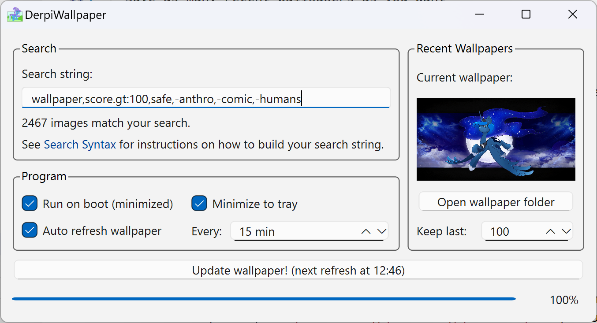

# DerpiWallpaper


A tiny Qt application that sets your wallpaper to a random derpibooru.org image matching a search string.

Features:
- No installation required
- Cross platform (tested on Windows, GNOME & KDE)
- Fully customizable via official Derpibooru [search syntax](https://derpibooru.org/pages/search_syntax)
- Configurable Auto refresh
- Save as many recent wallpapers as you want
- Small memory footprint (<50MB)

## Download
See the [Releases](https://github.com/tom300z/DerpiWallpaper/releases) page for downloads.

## How to use

Download the executable for your OS from the releases page and run it.

The app itself is pretty self explanatory. Just put the binary anywhere on your PC and start it. You can also configure the app to run on boot.

## Development
### Setting up the development environment
1. Install poetry
2. run `poetry install`

### Building the Standalone executable
Use the platform build scripts. They write/verify `data/version.txt` from Poetry and then run Nuitka.

#### Windows (PowerShell):
Requires Visual Studio Build Tools on PATH
```powershell
./scripts/build-windows.ps1
```

#### Linux (Bash):
Requires `python3 python3-dev patchelf gcc ccache`
```bash
bash ./scripts/build-linux.sh
```

#### macOS (Bash):
Requires Xcode Command Line Tools
```bash
bash ./scripts/build-macos.sh
```

### Vagrant VMs (optional)
For quick cross-OS testing in VMs using VirtualBox:

- Ubuntu Desktop: `cd vagrant/ubuntu; vagrant up`
- Windows 11: `cd vagrant/windows; vagrant up`

Both VMs sync the repo into the guest (`/mnt/derpiwallpaper` on Ubuntu, `C:\derpiwallpaper` on Windows).
